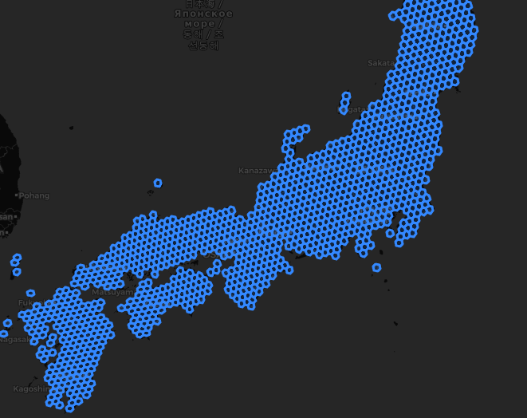
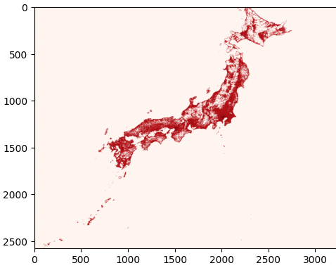
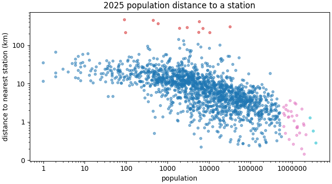
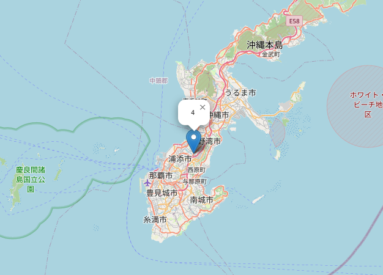
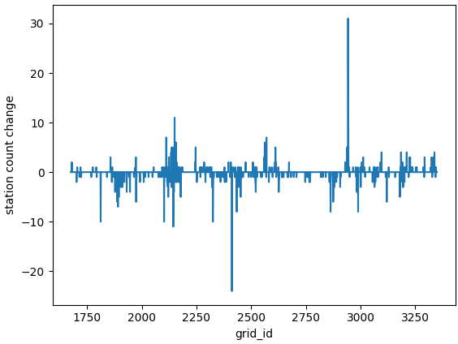

# Japan Rail Station Change

### Description
The purpose of this project is to help identify areas in Japan that are underserved or overloaded based on the relationship between train station coverage and population density. The goal is to identify areas that do not have an appropriate number of stations, stations in wrong relative location for population centers, changes in stations, or general outliers.

### Project Techniques Steps
1. Acquire station data from OpenStreetMap sources (API or Geofabrik extracts)
2. Build Japan's national boundaries from national coastline geometry and generate H3 hex grids for analysis
   1. 
3. Use geopandas spatial join between stations and H3 cells to compute per-grid station count, station lists, and coverage
4. Perform raster zonal analysis on WorldPop data and assign population to each H3 grid
   1. 
5. Calculate neighbor distances by measuring distance from each H3 centroid to the nearest station for each grid cell
6. Create unified analysis tables for downstream analysis
7. Analysis with correlation heatmaps and clustering (KMeans) to identify outlier grids and population patterns
   1. 
8. Compare historical snapshots for population and station change trends, then visualize results with Folium maps and matplotlib charts
   1.  

### Project Report
A report of the findings from the Jupyter notebook can be found [here](local/Report.pdf)

### Requirements
1. Databricks account and CLI (if using databricks version)
2. Jupyter

### Project Breakdown
Two versions of this project exist separately for different learning purposes.

1. Databricks
   1. This version uses a similar setup from the Jupyter notebook, but creates a deployment in the Databricks free tier.
   2. Databricks serverless free-tier has issues with the following packages, so parsing is done locally:
      1. osmium
      2. rasterstats
      3. rasterio
   3. Since rasterio and rasterstats is not allowed on Databricks serverless due to GDAL requirements, the following parquet files are created with the following lines at the end of the local notebook:
      ```python
        # Add year to the final dataframes
        final_df_2016['year'] = 2016
        final_df_2025['year'] = 2025
        
        # Combine dataframes
        df_combined = pd.concat([final_df_2016, final_df_2025], ignore_index=True)
        
        # Just take the 3 columns to assign population by grid
        df_population = df_combined[['h3_id', 'population', 'year']].copy()
        
        # Write the data to parquet file
        df_population.to_parquet('../databricks/data/population-by-grid.parquet')
        ```
   4. The following files will need to be uploaded to the created volume, due to serverless restrictions:
      1. [stations-list-2016](databricks/data/stations-list-2016.parquet)
      2. [stations-list-2025](databricks/data/stations-list-2025.parquet)
      3. [population-by-grid](databricks/data/population-by-grid.parquet)
   
2. Local
   1. This version utilizes a Jupyter notebook for analysis, storing results in dataframes and parquet files. This version was created first.
   2. The two data sources for local analysis need to be downloaded at the following links, and placed in the public-datasets/ folder:
      1. 2016 OSM PBF: https://download.geofabrik.de/asia/japan-160101.osm.pbf
      2. 2025 OSM PBF: https://download.geofabrik.de/asia/japan-250101.osm.pbf

### Deployment

1. Databricks
   1. Databricks DABs are used to deploy the pipeline, a YAML file is created to deploy this pipeline [dab](databricks/databricks.yml)
   2. Run the SQL commands to create catalog, schema, volumes [create-env.sql](databricks/create-env.sql)
   3. Deployment steps as follows:
      ```bash
      databricks bundle validate
      ```
      ```bash
      databricks bundle deploy
      ```

2. Local
   1. No deployment steps are necessary, open the notebook and step through each phase.

### Data sources
- Japan stations list (online): Overpass API
  - Producer: OpenStreetMap contributors (queried via Overpass API instance)
  - License: Open Database License (ODbL) 1.0 (OpenStreetMap data license)
- Japan stations list (offline): [Geofabrik](https://download.geofabrik.de/asia)
  - Producer: Geofabrik GmbH (extracts of OpenStreetMap data)
  - License: Open Database License (ODbL) 1.0 (OpenStreetMap data license)
- Japan coastline shp files: [Humdata](https://data.humdata.org/dataset/cod-xa-jpn)
  - Producer: OCHA Regional Office for Asia and the Pacific (ROAP)
  - License: Creative Commons Attribution for Intergovernmental Organisations (CC BY-IGO 3.0)
- Population data: [WorldPop](https://hub.worldpop.org/geodata/summary?id=77823)
  - Producer: WorldPop
  - License: Creative Commons Attribution 4.0 International (CC BY 4.0)